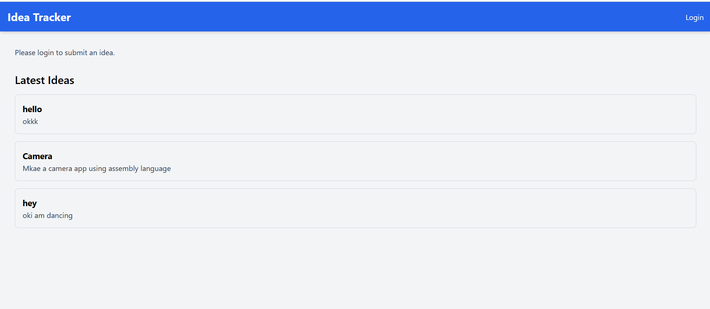

# Ideas Tracking using react js and appwrite


## To run this project use this command:

```
 npm run dev -- --open --port 3000
```

## Home Page


## Login Page


## Adding new ideas


## Appwrite


### Authentication


### Database (Collection)

